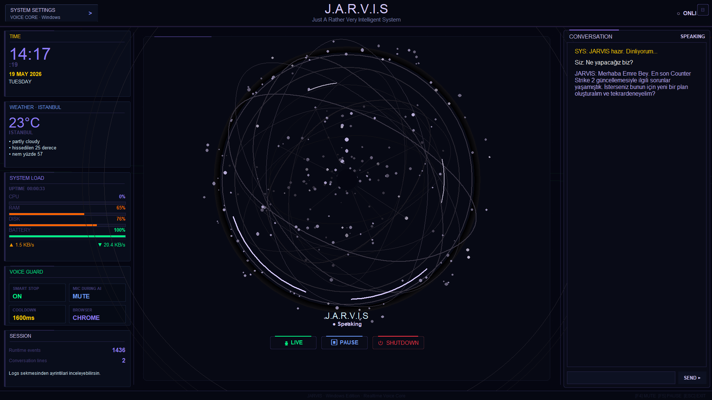
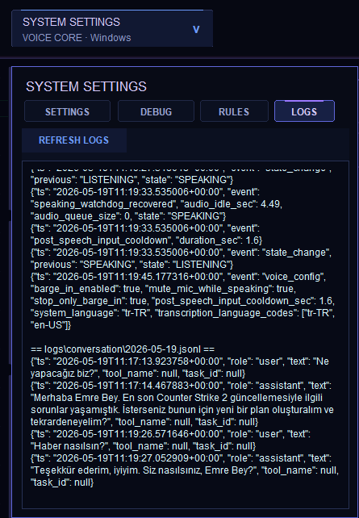
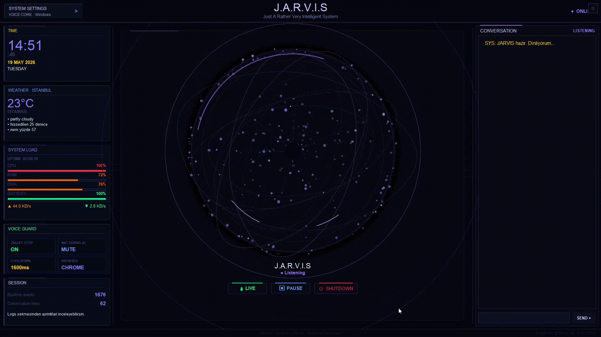
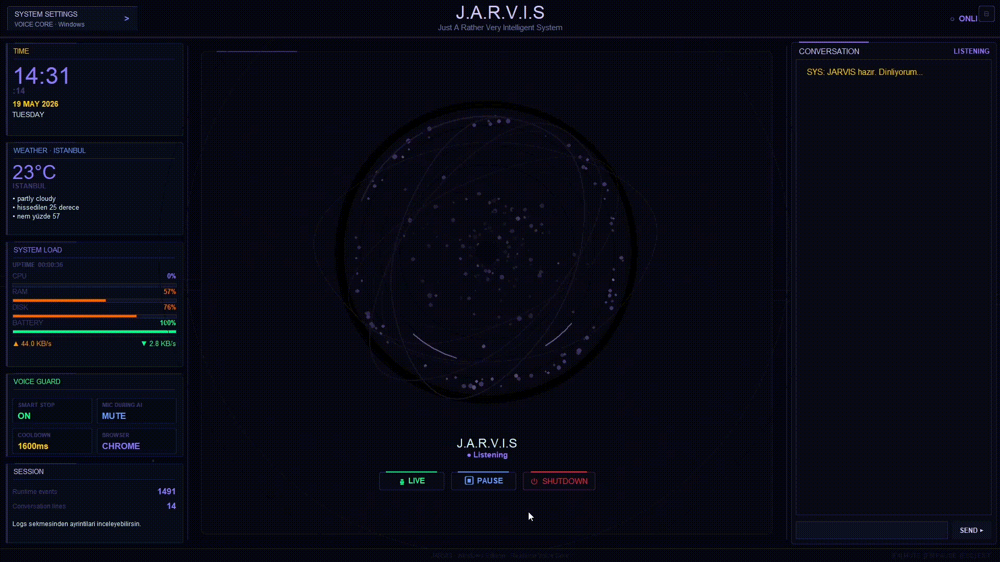
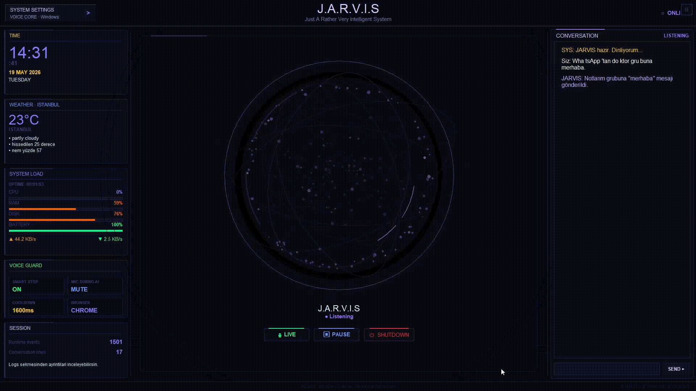
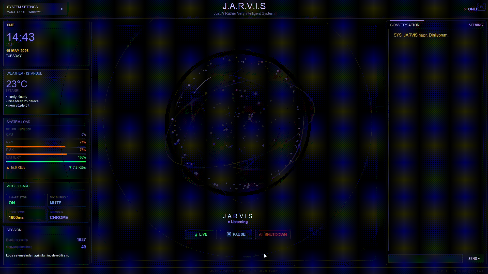
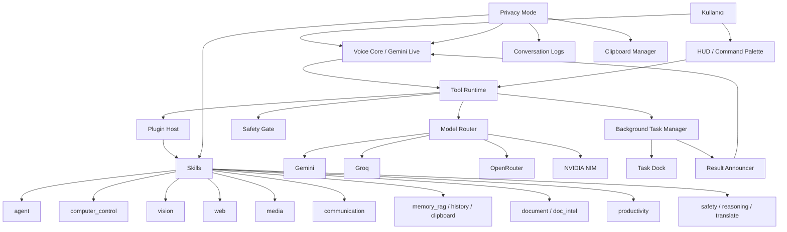

# JARVIS

Windows için geliştirilmiş, sesli komutlarla çalışan kişisel AI asistanı. JARVIS; Gemini Live API, modüler skill sistemi, bilgisayar kontrolü, arka plan görevleri, konuşma geçmişi, pano belleği, model yönlendirme ve gizlilik modunu tek masaüstü deneyiminde birleştirir.

<p align="center">
  <a href="https://www.python.org/"></a>
  
  
  
  
</p>

<p align="center">
  
</p>

<p align="center">
  <b>Voice-first desktop automation for Windows.</b><br>
  Konuş, planlasın, uygulasın, gerekirse ekrana baksın ve işi tamamlasın.
</p>

## İçindekiler

- [Demo](#demo)
- [Öne Çıkanlar](#öne-çıkanlar)
- [Mimari](#mimari)
- [Kurulum](#kurulum)
- [API Key Alma](#api-key-alma)
- [Yapılandırma](#yapılandırma)
- [Skill Sistemi](#skill-sistemi)
- [Proje Yapısı](#proje-yapısı)
- [Test](#test)
- [Güvenlik](#güvenlik)
- [Geliştirici](#geliştirici)

## Demo

JARVIS sadece sohbet eden bir asistan değil; yerel uygulamaları açabilir, web/medya akışlarını kontrol edebilir, mesaj gönderebilir, Steam gibi masaüstü uygulamalarında doğru hedefe ilerleyebilir ve yaptığı işlemleri loglayabilir.

| HUD ve çalışma görünümü | Log ve görev takibi |
| --- | --- |
|  |  |

### Canlı Senaryolar

| Steam | WhatsApp |
| --- | --- |
|  |  |

| Spotify | YouTube |
| --- | --- |
|  |  |

## Öne Çıkanlar

| Alan | Özellik |
| --- | --- |
| Sesli asistan | Gemini Live API ile gerçek zamanlı konuşma, mikrofon/ses yönetimi ve kesme desteği |
| HUD arayüzü | Tkinter tabanlı ana panel, waveform, tema sistemi, bildirimler ve görev dock'u |
| Komut paleti | `Ctrl+Shift+Space` ile tool, rutin ve hızlı komut arama |
| Bilgisayar kontrolü | Aktif pencere analizi, UI Automation, tıklama, uygulama açma ve tarayıcı otomasyonu |
| Agent modu | Doğal dil hedeflerini çok adımlı plana çevirme ve tool'larla yürütme |
| Model router | Gemini, Groq, OpenRouter ve NVIDIA sağlayıcıları arasında rota/fallback seçimi |
| Kota yönetimi | Birincil, ikincil ve ekstra Gemini API key havuzu |
| Arka plan görevleri | Uzun süren işleri background task olarak çalıştırma, iptal etme ve sonuç duyurma |
| Hafıza | Kalıcı kullanıcı belleği, konuşma geçmişi, pano geçmişi ve RAG tabanlı bellek |
| Gizlilik modu | Konuşma logları, pano tüketimi ve kalıcı yazımları durdurabilen merkezi privacy switch |
| Güvenlik katmanı | Riskli tool çağrısı değerlendirme, PII maskeleme ve içerik güvenliği |
| Genişletilebilirlik | `skills/` altında bağımsız paketlerle yeni yetenek ekleme |

## Mimari



## Kurulum

### Gereksinimler

- Windows 10/11 64-bit
- Python 3.11 veya üzeri
- Microsoft Visual C++ Redistributable
- Mikrofon ve ses çıkışı
- Minimum Gemini API key
- Gelişmiş özellikler için Groq, NVIDIA veya OpenRouter key'leri

### Hızlı Başlangıç

```cmd
setup.bat
run.bat
```

### Manuel Kurulum

```powershell
git clone <repo-url>
cd jarvis

python -m venv .venv
.\.venv\Scripts\Activate.ps1

pip install -r requirements.txt

copy config\api_keys.example.json config\api_keys.json
notepad config\api_keys.json

python main.py
```

Playwright kullanan web/browser özellikleri için gerekirse:

```powershell
python -m playwright install chromium
```

## API Key Alma

`config/api_keys.json` içindeki key alanlarını doldurun. Bu dosya kişisel olduğu için gerçek key ile GitHub'a gönderilmemelidir.

| Alan | Nereden alınır? | Zorunluluk | Not |
| --- | --- | --- | --- |
| `gemini_api_key` | https://aistudio.google.com/api-keys | Zorunlu | Ana sesli asistan akışı için gerekir |
| `gemini_secondary_api_key` | https://aistudio.google.com/api-keys | Opsiyonel | Kota/fallback için ikinci Gemini hesabı önerilir |
| `gemini_extra_api_keys` | https://aistudio.google.com/api-keys | Opsiyonel | Kota için farklı Google hesaplarından alınması önerilir |
| `groq_api_key` | https://console.groq.com/keys | Önerilir | Hızlı niyet sınıflandırma, metacognition ve düşük gecikmeli işler |
| `nvidia_api_key` | https://build.nvidia.com/settings/api-keys | Opsiyonel ama güçlü | NVIDIA NIM tabanlı vision, reasoning, RAG, safety, translate ve belge zekası |
| `openrouter_api_key` | https://openrouter.ai | Opsiyonel | Model Router fallback ve bazı agent/coder rotaları |
| `youtube_api_key` | Google Cloud Console | Opsiyonel | YouTube kanal raporu gibi medya özellikleri |
| `google_vision_api_key` | Google Cloud Console | Opsiyonel | Google Vision istemcisi kullanılan akışlar |

Gemini kota notu: `gemini_secondary_api_key` ve `gemini_extra_api_keys` aynı hesaptan değil, farklı Google hesaplarından alınırsa kota dağıtımı daha faydalı olur.

Örnek:

```json
{
  "gemini_api_key": "YOUR_GEMINI_KEY",
  "gemini_secondary_api_key": "",
  "gemini_extra_api_keys": ["", "", ""],
  "groq_api_key": "",
  "nvidia_api_key": "",
  "openrouter_api_key": ""
}
```

## Yapılandırma

| Ayar | Açıklama |
| --- | --- |
| `voice` | Gemini ses adı. Örnek: `Charon`, `Puck`, `Aoede`, `Kore` |
| `theme` | HUD teması. Örnek: `Teal Core`, `Crimson Core`, `Iris Core` |
| `system_language` | Asistanın ana dili. Varsayılan: `tr-TR` |
| `transcription_language_codes` | Ses tanıma dilleri. Örnek: `["tr-TR", "en-US"]` |
| `wake_word_enabled` | Wake word motorunu açar/kapatır |
| `privacy_mode_default` | Uygulama başlarken gizlilik modunun açık olup olmayacağı |
| `preferred_browser` | Browser automation için tercih edilen tarayıcı |
| `disabled_skills` | Devre dışı bırakılacak skill'ler |
| `model_router` | Sağlayıcı, model, fallback ve rota ayarları |
| `voice_control` | Barge-in, konuşurken mikrofon susturma, cooldown ve Groq sınıflandırma ayarları |

## Klavye Kısayolları

| Kısayol | Eylem |
| --- | --- |
| `Ctrl+Shift+Space` | Komut paletini aç |
| `F4` | Mikrofonu sustur/aç |
| `F5` | Duraklat/devam et |
| `F11` | Tam ekran |
| `Esc` | Kapat |

## Skill Sistemi

JARVIS'in yetenekleri `skills/` klasöründeki modüler paketlerden gelir. Her skill kendi manifestini ve tool fonksiyonlarını taşır. Plugin Host açılışta skill'leri keşfeder, bağımlılığı eksik olanları atlar, geçerli tool'ları Runtime'a kaydeder.

Yeni skill yazmak için [docs/skills.md](docs/skills.md) dosyasına bakın.

| Skill | Kısa açıklama |
| --- | --- |
| `agent` | Doğal dil hedeflerini çok adımlı plana çevirir ve tool'larla yürütür |
| `audio_structured` | Toplantı/telefon kayıtlarından aksiyon ve CRM çıktısı üretir |
| `clipboard` | Pano geçmişi ve pano geri çağırma |
| `communication` | WhatsApp ve e-posta araçları |
| `computer_control` | Uygulama açma, pencere kontrolü, URL açma ve bilgisayar etkileşimi |
| `creative` | Yaratıcı yazım, finansal analiz ve tıbbi soru-cevap gibi NVIDIA destekli işler |
| `document` | PDF/DOCX belge soru-cevap |
| `doc_intel` | Fatura, makbuz ve belge ayrıştırma |
| `embodied` | Ekran görüntüsünden GUI agent reasoning |
| `history` | Konuşma geçmişinde arama |
| `image_search` | Yerel görsel indeksleme ve semantik görsel arama |
| `media` | Medya oynatma ve YouTube kanal raporu |
| `memory_rag` | Uzun dönem bellek, vektör indeksleme ve RAG sorguları |
| `metacognition` | Hızlı niyet sınıflandırma ve eylem öz değerlendirme |
| `productivity` | Hava durumu, takvim ve hatırlatıcı araçları |
| `reasoning` | Plan üretme, plan kaydetme ve çok adımlı akıl yürütme |
| `safety` | PII maskeleme, içerik güvenliği, konu kontrolü ve deepfake tespiti |
| `system` | Sistem bilgisi, uygulama açma, shell ve temel sistem kontrolü |
| `translate` | Metin ve ekran çevirisi |
| `vision` | Ekran analizi, video obje tespiti, ses tablo çıkarımı ve NVIDIA vision/text görevleri |
| `web` | Tarayıcı kontrolü ve web otomasyonu |

NVIDIA bağımlı skill'ler `nvidia_api_key` yoksa otomatik devre dışı kalır. Bu sayede temel Gemini tabanlı deneyim çalışmaya devam eder.

## Proje Yapısı

```text
jarvis/
  main.py                  # Uygulama girişi ve JarvisLive akışı
  app_config.py            # Config yükleme, migration ve secret maskeleme
  actions/                 # Eski/uyumluluk action katmanı
  config/                  # API key örnekleri ve yerel config
  core/                    # Sistem prompt'u
  docs/                    # Geliştirici dokümantasyonu ve demo assetleri
  helpers/                 # Yardımcı modüller
  memory/                  # Bellek, vector store ve temiz başlangıç JSON'ları
  runtime/                 # Tool runtime, model router, privacy, task manager, logging
  skills/                  # Modüler yetenek paketleri
  tests/                   # Unit testler
  ui/                      # HUD, tema, komut paleti, toast, task dock
  voice/                   # Wake word ve sonuç duyurucu
  routines.json            # Kullanıcı tanımlı rutinler
```

## Test

```powershell
.\.venv\Scripts\python.exe -m pytest -q
```

Son yerel kontrolde:

```text
429 passed, 1 skipped
```

## Güvenlik

- Gerçek API key'leri repoya koymayın.
- `config/api_keys.json` kişisel dosyadır.
- `logs/` ve konuşma geçmişi kişisel veri içerebilir.
- `memory/*.json` dosyaları kullanıcı tercihleri, pano geçmişi veya kişisel not içerebilir.
- Public paylaşım öncesi key rotate etmek iyi pratiktir.
- Privacy Mode açıkken konuşma logları, pano tüketimi ve bazı kalıcı yazımlar durdurulur.

## Geliştirici

Emre Öcel

- Website: https://emreocell.github.io
- Instagram: https://www.instagram.com/emre.ocel/
- LinkedIn: https://www.linkedin.com/in/emreocell/

## Lisans

Bu proje [MIT License](LICENSE) ile lisanslanmıştır.
